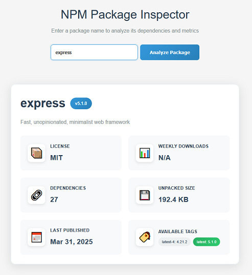

# NPM Package Dependency Inspector



A  web application that analyzes public NPM packages and displays metrics to help developers make decisions about the libraries they use.

## Project Overview

The NPM Package Dependency Inspector is a full-stack application built with **Spring Boot** (backend) and **Vue.js** (frontend) that provides developers with  insights about NPM packages. By entering a package name, users can view metrics including version information, licensing, download statistics, dependency counts, and more.

### Key Features

- **Package Analysis**: Fetch and analyze any public NPM package
- **Metrics**: Display current version, license, weekly downloads, dependency count, unpacked size, and last publish date
- **UI**: Clean, responsive Vue.js frontend with real-time data display
- **Reactive Backend**: Spring WebFlux for non-blocking, reactive API responses
- **Containerized**: Multi-stage Docker build for optimized production deployment
- **DevOps**: Complete CI/CD pipeline with GitHub Actions, pre-commit hooks, and automated testing

## Technology Stack

### Backend
- **Spring Boot 3.5.5** - Main application framework
- **Spring WebFlux** - Reactive web framework for non-blocking I/O
- **Java 21** - Latest LTS version with modern language features
- **Maven** - Dependency management and build tool

### Frontend
- **Vue.js 3** - Progressive JavaScript framework
- **Axios** - HTTP client for API communication
- **ESLint** - Code linting and quality enforcement

### DevOps & Infrastructure
- **Docker** - Multi-stage containerization
- **Docker Compose** - Local development orchestration
- **GitHub Actions** - Continuous Integration pipeline
- **Pre-commit Hooks** - Code quality enforcement

## Quick Start with Docker

### Prerequisites
- Docker and Docker Compose installed on your system
- Git (for cloning the repository)

### Running the Application

1. **Clone the repository**
   ```bash
   git clone <repository-url>
   cd jvn-project_npm-inspector
   ```

2. **Navigate to the starter directory**
   ```bash
   cd starter
   ```

3. **Start the application with Docker Compose**
   ```bash
   docker-compose up --build
   ```

4. **Access the application**
   - Open your browser and navigate to `http://localhost:8080`
   - The application will be running with both frontend and backend services

## Local Development Setup

### Prerequisites
- Java 21 or higher
- Node.js 18 or higher
- Maven 3.6 or higher

### Backend Setup

1. **Navigate to the starter directory**
   ```bash
   cd starter
   ```

2. **Run the Spring Boot application**
   ```bash
   ./mvnw spring-boot:run
   ```

3. **Backend will be available at** `http://localhost:8080`

### Frontend Setup

1. **Navigate to the frontend directory**
   ```bash
   cd starter/src/frontend
   ```

2. **Install dependencies**
   ```bash
   npm install
   ```

3. **Start the development server**
   ```bash
   npm run serve
   ```

4. **Frontend will be available at** `http://localhost:3000`

## API Endpoints

### Get Package Information
```http
GET /api/packages/{packageName}
```

**Example:**
```bash
curl http://localhost:8080/api/packages/react
```

**Response:**
```json
{
  "name": "react",
  "version": "18.2.0",
  "license": "MIT",
  "weeklyDownloads": 25000000,
  "dependencyCount": 2,
  "unpackedSize": 1024000,
  "lastPublishDate": "2023-05-03T10:30:00",
  "description": "React is a JavaScript library for building user interfaces.",
  "distTags": {
    "latest": "18.2.0",
    "next": "18.3.0-alpha.0"
  }
}
```

## Architecture & Design Choices

### Multi-Stage Docker Build
The application uses a **multi-stage Dockerfile** for optimal production images:

1. **Frontend Builder Stage**: Builds the Vue.js application
2. **Backend Builder Stage**: Compiles the Spring Boot application
3. **Production Runtime Stage**: Creates a minimal JRE image with the built artifacts

**Benefits:**
- Smaller production image size
- Better security
- Faster deployment and startup times

## Development Tools

### Pre-commit Hooks
The project includes pre-commit hooks that enforce code quality:

```bash
# Install pre-commit hooks
./setup-hooks.sh  # Linux/Mac
./setup-hooks.bat # Windows
```

**Hook Features:**
- **NPM Audit**: Prevents commits with high-severity vulnerabilities
- **Linting**: Catches potential issues before commit

### CI/CD Pipeline
GitHub Actions workflow with two parallel jobs:

1. **Lint Job**: Code quality checks
   - Frontend ESLint validation
   - Java compilation verification
   
2. **Test Job**: Comprehensive testing
   - Java unit tests
   - Frontend placeholder tests
   - Full application build
